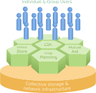

# Runrig: A Plan for Socio-ecological Design
## Purpose
In its narrowest sense, Runrig is a technology framework for the communal
management of a foodshed's digital assets, potentially spanning a network of
cooperating foodsheds. To the degree that such information may control the flow
of actual material resources, it may be viewed as a tool for the democratic
management of food, labor, land and other resources that such information
represents. In today's paradigm of "platform capitalism", technology companies
derive their wealth and power by mediating interactions between users and
capturing a portion of the value exchanged in the process. That portion only
grows over time, even when the platform is no longer needed to mediate such an
exchange.[^Muldoon] By recognizing this, and reclaiming common ownership of the
technologies that mediate relations between farmers, distributors, drivers,
wholesalers, retailers, commercial buyers and end consumers, Runrig aspires to
nothing less than the total redistribution of that value, giving control of the
wealth and power it creates back to the people who created it.

## Three Layers of Autonomy
To understand what Runrig does, we can start by examining what kind of digital
assets it is intended to manage. Partly for explanatory purposes, but also for
reasons that will become clear later on, let's separate assets into two very
broad categories: the data itself, and the software programs that capture,
process and generally make use of such data. Free software proponents and
privacy advocates have spilt a good deal of ink advancing the argument that true
autonomy in computing requires control of both the data and the software, not to
mention the hardware the whole system runs on.[^Stallman] [^Tisne] [^EFF] As the
old saying goes: "There is no cloud, just someone else's computer."[^cloud]
Efforts to achieve computational autonomy, however, rarely exceed a vision for
_individual autonomy_, and so are inevitably limited by _individual capability_.
These solutions generally fall short in one of two ways: either they must
curtail the range of functionality users have come to expect from so-called
"Software-as-a-Service" (SaaS) platforms; or they foist the burdens of
administering and maintaining those systems onto users who lack the capability
to do so. Telling average users, who seek an alternative to predatory cloud
platforms, that they can just spin up a service on their own server rack or VPS
(then run backups and install updates all by themselves forevermore) is no
better than playing the world's smallest violin for them.[^Bob] If free software
and open source advocates focus too narrowly on licensing and sharing source
code, while overlooking the actual capabilities this affords their users, then
at best they can only offer _permissive freedom_, not _effective freedom_, as
Luis Villa observes.[^Villa] In other words, they've granted permission to
freely use the software, in a purely hypothetical sense, but not the real
capability to use it in any practical or meaningful sense.

Runrig differs from other open source methodologies by coordinating the pooled
capabilities of a community under democratic and cooperativist principles of
governance. This way, ownership and control of both the data and the software
can be shared collectively by all participants in a foodshed, while preserving
the rights of individual users. To achieve this, Runrig comprises 2 - 3
functional layers:

1. A single, collectively owned data storage provider, or "pod"[^pod] provider.
2. Many federated cooperative service platforms.
3. Local-first[^Kleppmann] and self-hosted applications (optional).

With sufficient investment, the server racks, network infrastructure,
brick-and-mortar facilities and other physical assets required to run these
systems could be cooperatively owned as well. For now, however, Runrig restricts
itself to the digital assets, since their storage and management can be
cooperativized at a much lower upfront cost.

### The Data Provider
The first layer is a global commons, providing networked data storage to all its
members as a shared service, while diffusing the costs and responsibilities of
managing the underlying databases and infrastructure such a system entails. This
layer corresponds to the data category of digital assets, as outlined above, and
should be relatively indifferent to the shape of that data or how it's intended
to be used.

This data provider can be thought of as a kind of cloud-based file system, like
Dropbox or Google Drive, accessible from anywhere with an Internet connection,
but with two key differences. First, it is collectively owned by all its
members, not some corporation and its shareholders. So while it may not be each
user's private computer, it is still _their computer_ in a very real sense, with
full governance rights over the infrastructure hosting their data, in addition
to individual protections under the terms of service. Secondly, while it could
in fact be used as a file system, its true potential lies in being a source of
structured data, like an SQL database or even more modern low-code databases
like NocoDB, a _libre_ alternative to Airtable. This gives it the power to
integrate more readily with a myriad of existing services via its API.

### Service Platforms
The second layer is a federation of platform cooperatives[^Scholz], which can
run the gamut of web-based applications and other software services, like the
ones we're all accustomed to today. This layer corresponds to the software
category of digital assets, but it draws its core data from the first layer, the
data provider, linking the two layers programmatically as well as contractually.
Services might include consumer-facing ecommerce sites or wholesale buying
clubs, crop management software and record keeping, logistical and fleet
management, bookkeeping, timesharing for certified kitchen space, etc. A
platform is not limited to providing a single service, and it can have separate
websites set up for separate services, or integrated as one. For example, there
may be one site where retail customers place orders and another site where
farmers track inventory through a different service. Critically, however, the
two systems would still be integrated, sharing infrastructure, operating costs,
and a unity of purpose. Users would also enjoy a seamless "single sign-on"
between services, because the data provider can double as a secure identity
provider as well.

Each of these service-oriented platform coops would function best within a
geographically contiguous region, what we loosely call a foodshed, food
zone[^zone] or bioregion. This way they can curate the services provided on
their platform in order to best suit the needs of their members. They can even
tailor the configuration and features of specific services as they choose. For
example, if a platform wants to add a service for aggregating CSA orders, they
can do so easily. If they need a specialized feature for a citrus CSA and one
exists, they can enable it. If it doesn't already exist, they can sponsor its
development and contribute the open source feature back to the commons.
Meanwhile, other platforms could add features for a flower CSA instead, or omit
the CSA service entirely. In this way, geographic regions offer a sensible
criterion for bounding a platform's scope of functionality, since some services
might make sense in one region or climate but not another. It also keeps
governance more manageable, when not trying to accommodate the needs of a larger
and more dispersed membership. In theory nothing prevents a platform from being
as small or large as desired, but each platform will require some combination of
time, expertise and money to maintain, so the distribution of those costs should
be balanced with the desire for more localized control. Nevertheless, it
shouldn't be necessary to impose strict boundaries on any one platform's range
of coverage, and users would be free to join more than one platform if available
and desirable. It may also prove useful to cover a more dispersed geographic
area, for niche sectors of production or distribution, like pasture-raised meats
or high-value crops. These are tradeoffs that should be left to the thoughtful
deliberation of the constituents of each platform, so they can strike the right
balance to meet their own goals given their unique circumstances.

This second layer, regardless of the particular platform or service, is also the
layer that users will typically interact with. It will be the service platform's
website where most users sign-up for an account, assuming they've been approved
for membership in the cooperative that operates and governs that platform. In
the same stroke, they will gain membership to the global data provider as well.
They will be given a data pod that belongs exclusively to them, designated by a
unique address, so that the first layer will also serve as an identity provider,
much like an email address. The technical process can remain invisible to the
user, but they can feel assured that their data is theirs to control. This is
backed up by the fact that they hold a share in the governance of how the data
provider stores their data, as well as a share in how any service platform they
join is allowed to use it. If at any time they wish to join a different service
or leave entirely, they can more easily bring their data along with them,
because portability is a fundamental aspect of the design.

Ultimately, the service platforms only mediate the exchange between the data
provider and the user, both in terms of the actual data exchange, as well as the
service level agreements between all three parties. That is not to say that
power users are prevented from interacting directly with the data provider,
especially if they have programming knowledge; they just don't _have_ to do so
directly. They don't have to be aware how those data transactions work, or that
the data provider even exists, although hopefully they will appreciate that
regardless of what service platform they use, they retain certain rights over
both their data and how the storage of it is administered.

### Local-first & Self-hosted Applications
The third layer is comprised of local-first applications, which individual users
can install on their personal desktop and mobile devices, as well as self-hosted
services, where the more technically savvy users are so inclined. These are not
strictly necessary, however, and will only appeal to certain users at first. The
other two layers are perfectly capable of providing fully featured web-based
applications on their own, without the need to install and maintain purely local
instances. Yet the possibility emerges quite spontaneously from the other two
layers due to their intrinsically distributed nature. This affords the potential
for additional peer-to-peer features and decentralized functionality, which
could provide greater resilience to the overall network while also granting more
freedom to individual users outside of those networks.

The details of this are still less critical to Runrig's initial development, but
will be further explicated in the ["Architecture"] section of this proposal,
though it is still in draft.

## Strategy
### Part of a Larger Ecosystem
Brought to its full potential, Runrig goes far beyond what a single software
project or platform can achieve. Its main value proposition is that it opens up
new ways for complex, distributed networks of groups and individuals to
collaborate freely and productively. It would be arrogant to presume that we
could bootstrap an inherently collaborative, widespread network from the ground
up, in a few short development cycles with only a handful of engineers,
designers and agriculturalists. Fortunately, that is not our task; we draw upon
a rich substratum of prior work that has already established the necessary
standards, technical infrastructure, methodologies and other essential building
blocks that make Runrig possible.

Food standards and ontologies have been pioneered by such groups as the Data
Food Consortium[^DFC], stewarded as an international collaboration by the Open
Food Network. There also exists a full suite of agricultural tools from
OpenTEAM[^OpenTEAM], including the farmOS Data Model[^farmOS], which enjoy the
continued support of the USDA, the Foundation for Food and Agricultural Research
and other public and private partners.

These foundational projects are themselves part of a broader groundswell of
technological advancements, particularly within the field of federated and
peer-to-peer systems. Over the last two decades or more, Tim Berners-Lee and the
W3C have spearheaded the drive for a Semantic Web,[^W3C] which has made
tremendous strides in just the last few years. Practical implementations of the
Solid Protocol and WebID have now reached production, and community-supported
servers are free to join or can be deployed independently as a testbed for
Runrig's data provider.[^Solid] [^pod] [^CSS] Parallel developments like
ActivityPub, while not strictly applicable to food and agriculture, provide a
template for how standards and shared toolchains can evolve by methods of open
innovation and collaboration.[^ActivityPub] [^ActivityPub_FSF]

By taking advantage of these open standards and tools, there is a lot that can
be done by essentially snapping together off-the-shelf components. Combining
that with the collaborative methodologies that have become all but customary in
these communities, Runrig can enjoy a degree of near-term stability and
long-term sustainability that are rarely found among early-stage startups.

### Unique Advantages
These open source methodologies, free software libraries and proven models for
standards development will all be instrumental in building our own network of
service platforms for food production and distribution; however, Runrig's
greatest advantage is how it can build directly on top of existing networks to
deploy practical solutions today, while the larger technical infrastructure can
grow incrementally, along with the networks of trust and social infrastructure
undergirding the technical aspects.

This is where the separation between the data and software layers, as outlined
above, proves so decisive. Because the service platforms are decoupled from the
data source, they can be adapted to send and receive data to and from
preexisting platforms based on compatible _libre_ software systems, with very
little additional overhead. This is not for the purpose of supplanting those
platforms; rather, Runrig can complement their range of functionality and open
up new avenues of potential development within the entire ecosystem.

The full value of this separation of concerns is best demonstrated by the way
Runrig can prototype novel solutions that satisfy edge cases and fill critical
gaps in the feature offerings of other _libre_ software platforms. There will
always be features that either fall outside the scope of more mature platforms,
prove too costly to develop due to particular implementation details or accrued
technical debt, or that merely get deprioritized in the context of more pressing
concerns. These costs and other hindrances shrink to almost nothing, however,
when an independent service can take full advantage of the existing platform's
network and data storage, while still enjoying effective greenfield project
status, unconstrained by previous design choices.

For example, one prototype we've discussed in the Skywoman MAIA Project is a
post-planting survey for a producer coop to audit its member-farms and asses
whether they are on target to match anticipated sales volumes. The coop manager
only needs to send the survey out once or twice per season to about a dozen
farms, but it could save her a lot of precious time otherwise spent on site
visits.[^MAIA] Runrig could host the data, structured as farmOS plans, assets
and logs,[^farmOS] while also being compatible with the Solid protocol. This
could be done with a self-hosted Solid Server[^CSS] or even just a simple JSON
document which could be transformed to a spreadsheet once the responses were
collected; for this proof-of-concept, at least, the data requirements are
miniscule. The survey itself could be created using SurveyStack, a low-code
solution provided by Our Sci and OpenTEAM, with integrations already available
with the farmOS Data Model.[^SurveyStack]

While solutions like this have a payoff about on par with a Google Form plus a
spreadsheet, the costs of developing and maintaining them with Runrig are still
very low. Spreadsheets may be easier to create, but often prove much harder to
maintain in the long-run. And what costs exist are not sunk costs; if the
results aren't totally satisfactory, they can stick to the spreadsheets from
then on, without losing that data or needing to export it from a third-party
system. Maybe they like the concept, but want something more "off the shelf"
like farmOS or Inrupt, in which case the data is easily ported there. And of
course if they're happy enough with the system as it is, or want to continue
building its potential to meet their unique circumstances, development can
continue apace with Runrig. Best of all, none of these options are mutually
exclusive, and in fact, the coop could keep on using the latter two options in
parallel, getting the best of both worlds, without any serious costs associated
with keeping the two redundant data sources synchronized.

That's where Runrig can most benefit other platforms in the ecosystem, by
catching the spillover of feature creep that inevitably besets older software
projects, while accommodating users for whom the lack of those features would
otherwise be a deal breaker. A synergy arises between Runrig and other free
software platforms, expanding the user base for each, which wouldn't be possible
if Runrig's data and service layers were more tightly coupled.

### Ecology Over Architecture
Runrig will center ecological design over any specific technological
architecture. Ecology, in this sense, encompasses the technological, social and
biotic aspects of design, together and all at once. Accordingly, we strive to
make those designs adaptive to the whole, rather than prescriptive in the
particular.

In a practical sense, this grants us greater freedom to experiment with these
technologies. The example of the auditing survey mentioned above is a prime
example. The solution is small, almost trifling, and it risks very little;
however, it can have very real benefits, meeting the most immediate, material
concerns of its users. While it can be tossed aside if it proves unhelpful, it
could just as well form the kernel of a much larger system. In that sense, it's
hardly even fair to call it a prototype. This is yet another direct consequence
of separating the data provider from the services, an intrinsic element of the
overall design that can be achieved from the start, without temporary
expedients. In this way, the eventual contours of the superstructure are
imprinted at the very laying of its foundations.

This design would give Runrig some rather attractive scaling properties, but
"scale" alone is grossly inadequate for describing the full benefits. The
continued ability for experimentation and free play, _jeu libre_, throughout the
lifespan of the project, and the potential it yields cannot be understated. The
design choice to enable the collective stewardship of data, together with the
free and open sharing of the software, is as much a principle of social design
as it is a technological one. It imparts a vitality and iterative quality to the
project, akin to the Agile methodology, but extending well beyond mere product
development. The evolution of the software system is only one factor in the
evolution of the broader social and natural systems in which it is embedded.
Experiments, whether they succeed or fail; ad hoc solutions, whether they can be
adapted to general uses or not; shared techniques and information, whether that
sharing is reciprocated or not — all of these outcomes will be metabolized just
the same within an open system of communal ownership, and so their lessons and
shared progress always nurture the whole.

It should be pointed out that the separation between the data and service layers
is by no means absolute; again, such prescriptiveness is to be avoided. The
services will always have some data which they persist themselves, and there's
obviously no way the data provider could provide data if it were not itself
acting as a service. The key abstraction is more social than technical in
nature, intended to deconstruct the prevailing notion that both data and
services must be centralized with strict top-down control, as well as the
countervailing notion that our best alternative is strict decentralization,
where data and services are still co-located in discreet instances. The aim is
to empower new, imaginative configurations that instead emphasize the freedom of
users, both as individuals and collectively, to determine the location of their
data, how it is used and in what directions it flows. Tight coupling of the two
layers restricts that movement, stifling the health of the overall ecosystem, to
say nothing of what that means for the effective freedom of the people within
it.

Technology can be far more than an extension of the greater capitalist
apparatus, alienating us more and more each day from the living world and from
each other; it can be reclaimed as a vital part of human life. To invite
ecological characteristics back into our technologies and design is to
reintegrate them with the natural and social worlds.

## Next Steps
In the [Runrig Roadmap for 2024] we propose a [3-phase business model] for a
workers cooperative, which can then steward the development of the platform
cooperatives and eventually "One Big Data Co-op," à la Bill Haywood and the
Wobblies. Right now as a volunteer-driven group, we're in _Phase Zero_. Before
taking any contracts or pursuing grants for the following phases, we're building
out one or two [reference implementations] to test the viability of the model at
each phase of development. We're holding open workshops every other week, along
with community chat rooms and discussion boards, so anyone can [get involved].
As we progress, we're actively seeking partnerships and collaborations with
similarly aligned organizations, and eventually hope to recruit farmers, food &
tech workers and activists as coop members, so [sign up] for our newsletter to
receive occasional updates.

The Runrig Plan is a living document that describes the main design principles
of the social and ecological technologies we are building now and in the near
future. In addition to this overview, two appendices are also presented now,
though they are still in a very rough stage of draft. The ["Architecture"] page
will go into more technical detail of the underlying software and networking
systems involved in the implementation of Runrig, while the ["Ecology"] page
will cover more of the social, environmental and economic aspects of the plan,
as well as governance structures and legal considerations.

## References
[^Muldoon]: Muldoon, James. _Platform Socialism: How to Reclaim our Digital
    Future from Big Tech_. p. 14-15.
[^Stallman]: Stallman, Richard. ["Who does that server really
    serve?"](https://www.gnu.org/philosophy/who-does-that-server-really-serve.en.html)
[^Tisne]: Tisne, Martin. ["It’s time for a Bill of Data
    Rights"](https://www.technologyreview.com/2018/12/14/138615/its-time-for-a-bill-of-data-rights/)
[^EFF]: Cyphers, Bennett and Cory Doctorow. ["Privacy Without Monopoly: Data
    Protection and
    Interoperability"](https://www.eff.org/wp/interoperability-and-privacy). Feb
    12, 2021.
[^cloud]: Watterson, Chris. ["The Success Of My 'There Is No Cloud'
    Sticker"](https://www.chriswatterston.com/article/success-of-my-there-is-no-cloud-sticker).
[^Bob]: ["Fault-tolerance"](http://howfuckedismydatabase.com/nosql/).
[^Villa]: Villa, Luis. ["Free as
    in...?"](https://lu.is/blog/2016/03/23/free-as-in-my-libreplanet-2016-talk/)
[^pod]: Solid Project. ["Get a Pod"](https://solidproject.org/users/get-a-pod).
[^Kleppmann]: Kleppmann, Martin et al. ["Local-first software: You own your
    data, in spite of the cloud"](https://www.inkandswitch.com/local-first/).
    _Ink & Switch_.
[^Scholz]: Scholz, Trebor. [_Platform Cooperativism: Challenging the Corporate
    Sharing Economy_](https://rosalux.nyc/pslatform-cooperativism-2/).
[^zone]: ["The Food Zones
    Explained"](https://betterfoodtraders.org/why-it-matters/the-food-zones/)
[^DFC]: Data Food Consortium. ["Our
    Standard"](https://www.datafoodconsortium.org/en/our-standard/).
[^OpenTEAM]: OpenTEAM. ["Access Tools and
    Support"](https://openteam.community/access-tools-and-support/).
[^farmOS]: farmOS. [farmOS Data Model](https://farmos.org/model).
[^W3C]: The World Wide Web Consortium. ["Semantic
    Web"](https://www.w3.org/standards/semanticweb/).
[^Solid]: Solid Project. ["Solid Technical
    Reports"](https://solidproject.org/TR/).
[^CSS]: Solid Project. ["Running your own Solid
    server"](https://solidproject.org/self-hosting/css).
[^ActivityPub]: Lemmer Webber, Christine. ["ActivityPub is a W3C
    Recommendation"](http://dustycloud.org/blog/activitypub-is-a-w3c-recommendation/).
[^ActivityPub_FSF]: Lemmer Webber, Christine. ["Victory for libre networks:
    ActivityPub is now a W3C recommended
    standard"](https://www.fsf.org/blogs/community/victory-for-libre-networks-activitypub-is-now-a-w3c-recommended-standard).
[^MAIA]: Skywoman MAIA Project. ["OSU Microfarm Project & Richland
    Gro-Op"](https://github.com/skywoman/multifarm-aggregation-info-arch/tree/main/interviews/2022_08_12--Kip_Curtis_and_Richland_Gro_Op)
[^SurveyStack]: SurveyStack. ["Survey software designed to empower shared
    community knowledge."](https://www.surveystack.io/)

[Runrig Roadmap for 2024]: /roadmap-2024
[3-phase business model]: /roadmap-2024#three-phase-business-plan
[reference implementations]: /roadmap-2024#projects-for-2024
[get involved]: /get-involved.md
[sign up]: https://buttondown.email/runrig
["Architecture"]: ./architecture.md
["Ecology"]: ./ecology.md
